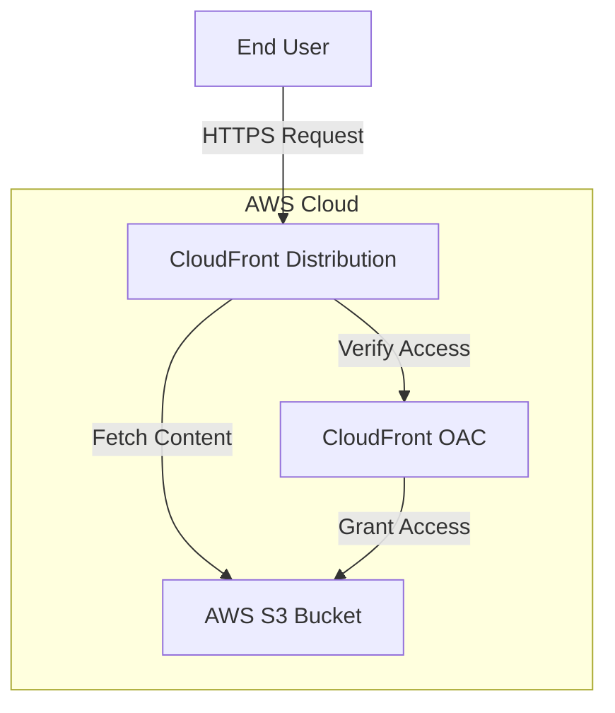
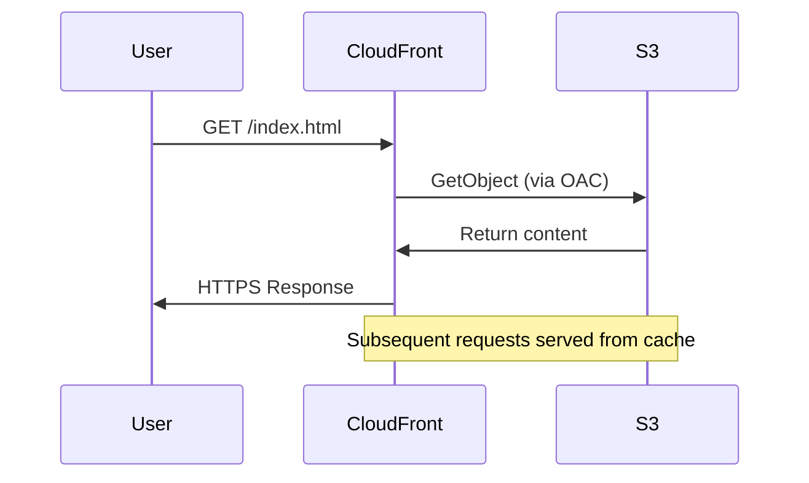

# Project 1: Static Website Hosting - System Design

## 1. Architecture Overview

This project demonstrates deploying a static website on AWS using S3 for storage and CloudFront for global content delivery.

### High-Level Architecture



### Data Flow

1. User requests website via CloudFront URL
2. CloudFront checks cache for requested content
3. If not cached, CloudFront fetches from S3 bucket
4. S3 verifies access via Origin Access Control (OAC)
5. Content is returned to CloudFront and cached
6. Content is delivered to user with HTTPS

---

## 2. Component Details

### 2.1 S3 Bucket

| Property | Value |
|----------|-------|
| Type | AWS S3 Bucket |
| Purpose | Host static website files |
| Encryption | AES256 (Server-side) |
| Public Access | Blocked at bucket level |

**Resources Created:**
- [`aws_s3_bucket.firstbucket`](/project_1/code/main.tf:6) - Main S3 bucket
- [`aws_s3_bucket_server_side_encryption_configuration.encryption`](/project_1/code/main.tf:27) - Server-side encryption
- [`aws_s3_bucket_public_access_block.public_access_block`](/project_1/code/main.tf:16) - Public access block

### 2.2 S3 Objects

| File | Type | Purpose |
|------|------|---------|
| index.html | text/html | Main HTML page |
| styles.css | text/css | Styling |
| script.js | application/javascript | Client-side logic |

**Resource:** [`aws_s3_bucket_object.object`](/project_1/code/main.tf:80)

Uses `fileset()` to dynamically upload all files from the `www/` directory with proper MIME types.

### 2.3 CloudFront Origin Access Control (OAC)

| Property | Value |
|----------|-------|
| Name | firstbucket-oac |
| Origin Type | s3 |
| Signing Behavior | always |
| Signing Protocol | SigV4 |

**Resource:** [`aws_cloudfront_origin_access_control.oac`](/project_1/code/main.tf:38)

Purpose: Securely restrict S3 bucket access so only CloudFront can fetch content.

### 2.4 S3 Bucket Policy

| Property | Value |
|----------|-------|
| Principal | cloudfront.amazonaws.com |
| Actions | s3:GetObject, s3:ListBucket |
| Condition | SourceArn matches CloudFront distribution |

**Resource:** [`aws_s3_bucket_policy.first_bucket_policy`](/project_1/code/main.tf:49)

Enables CloudFront to access S3 while keeping bucket public access blocked.

### 2.5 CloudFront Distribution

| Property | Value |
|----------|-------|
| Enabled | true |
| IPv6 | Enabled |
| Default Root Object | index.html |
| Price Class | PriceClass_200 |
| Viewer Protocol | Redirect HTTP to HTTPS |
| Default TTL | 3600 seconds |
| Min TTL | 0 seconds |
| Max TTL | 86400 seconds |

**Resource:** [`aws_cloudfront_distribution.s3_distribution`](/project_1/code/main.tf:104)

---

## 3. Security Configuration

### 3.1 Public Access Block

```hcl
block_public_acls       = true
block_public_policy     = true
ignore_public_acls      = true
restrict_public_buckets = true
```

### 3.2 S3 Bucket Policy

Only CloudFront can access the S3 bucket:
- Principal: `cloudfront.amazonaws.com`
- Actions: `s3:GetObject`, `s3:ListBucket`
- Condition: Valid CloudFront distribution ARN

### 3.3 Viewer Protocol Policy

All HTTP requests are redirected to HTTPS for secure communication.

---

## 4. Network Flow



---

## 5. Outputs

| Output | Description |
|--------|-------------|
| s3_bucket_name | Name of the S3 bucket |
| s3_bucket_arn | ARN of the S3 bucket |
| s3_bucket_domain_name | Domain name of the S3 bucket |
| cloudfront_distribution_id | ID of the CloudFront distribution |
| cloudfront_distribution_arn | ARN of the CloudFront distribution |
| website_url | Full URL of the deployed website |
| cloudfront_domain_name | CloudFront domain name |

---

## 6. Cost Considerations

| Service | Cost Factor |
|---------|-------------|
| S3 | Storage + Requests |
| CloudFront | Data Transfer + Requests |
| Route 53 | (Optional) Domain DNS |

**Note:** This project uses CloudFront's default certificate. For production, consider custom domains with ACM.

---

## 7. Design Decisions

### 7.1 Why OAC instead of OAI?
CloudFront OAC (Origin Access Control) is the newer, recommended method for securing S3 origins. It supports:
- All S3 buckets in all regions
- SSE-KMS encrypted objects
- Cross-account access

### 7.2 Why PriceClass_200?
Covers US, Canada, Europe - suitable for demos and cost-effective for global content.

### 7.3 Why fileset() for uploads?
Dynamic file upload allows adding new website files without modifying Terraform code.

---

## 8. Architecture Diagram


---

## 9. Related Files

- [main.tf](/project_1/code/main.tf) - Main infrastructure code
- [variables.tf](/project_1/code/variables.tf) - Input variables
- [outputs.tf](/project_1/code/outputs.tf) - Output definitions
- [provider.tf](/project_1/code/provider.tf) - AWS provider configuration
- [www/](/project_1/code/www/) - Website source files
