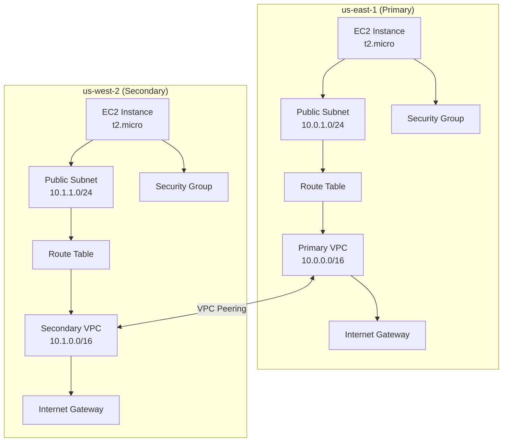
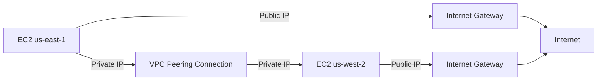
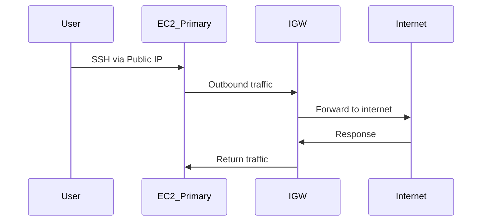
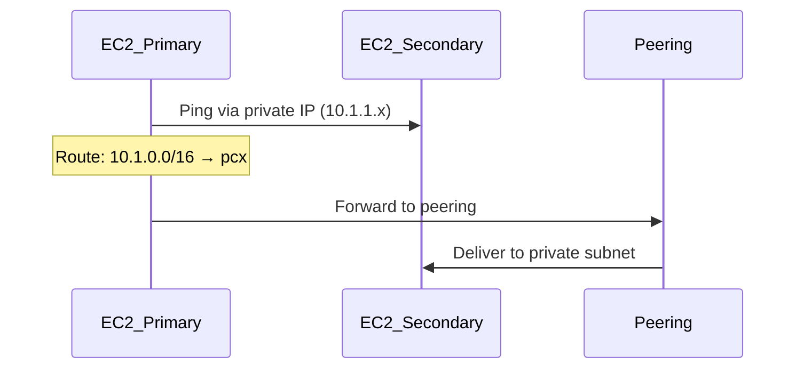

# Project 2: VPC and Peering - System Design

## 1. Architecture Overview

This project demonstrates AWS VPC Peering by creating two VPCs in different AWS regions and establishing a cross-region peering connection between them.

### High-Level Architecture



### Cross-Region Communication



---

## 2. Component Details

### 2.1 VPCs

#### Primary VPC (us-east-1)

| Property | Value |
|----------|-------|
| CIDR Block | 10.0.0.0/16 |
| DNS Hostnames | Enabled |
| DNS Support | Enabled |
| Instance Tenancy | default |

**Resource:** [`aws_vpc.primary_vpc`](/project_2/code/main.tf:1)

#### Secondary VPC (us-west-2)

| Property | Value |
|----------|-------|
| CIDR Block | 10.1.0.0/16 |
| DNS Hostnames | Enabled |
| DNS Support | Enabled |
| Instance Tenancy | default |

**Resource:** [`aws_vpc.secondary_vpc`](/project_2/code/main.tf:13)

### 2.2 Subnets

| VPC | Subnet CIDR | Availability Zone | Public IP |
|-----|-------------|-------------------|------------|
| Primary (us-east-1) | 10.0.1.0/24 | us-east-1a | Yes |
| Secondary (us-west-2) | 10.1.1.0/24 | us-west-2a | Yes |

**Resources:**
- [`aws_subnet.primary_subnet`](/project_2/code/main.tf:25)
- [`aws_subnet.secondary_subnet`](/project_2/code/main.tf:38)

### 2.3 Internet Gateways

| VPC | Purpose |
|-----|---------|
| Primary | Enable internet access for instances |
| Secondary | Enable internet access for instances |

**Resources:**
- [`aws_internet_gateway.primary_igw`](/project_2/code/main.tf:51)
- [`aws_internet_gateway.secondary_igw`](/project_2/code/main.tf:61)

### 2.4 Route Tables

#### Primary VPC Route Table

| Destination | Target |
|-------------|--------|
| 10.0.0.0/16 | local |
| 0.0.0.0/0 | igw-primary |

**Routes Added After Peering:**
| Destination | Target |
|-------------|--------|
| 10.1.0.0/16 | pcx-primary |

#### Secondary VPC Route Table

| Destination | Target |
|-------------|--------|
| 10.1.0.0/16 | local |
| 0.0.0.0/0 | igw-secondary |

**Routes Added After Peering:**
| Destination | Target |
|-------------|--------|
| 10.0.0.0/16 | pcx-secondary |

**Resources:**
- [`aws_route_table.primary_rt`](/project_2/code/main.tf:72)
- [`aws_route_table.secondary_rt`](/project_2/code/main.tf:88)
- [`aws_route_table_association.primary_rta`](/project_2/code/main.tf:104)
- [`aws_route_table_association.secondary_rta`](/project_2/code/main.tf:110)

### 2.5 VPC Peering Connection

| Property | Value |
|----------|-------|
| Type | Cross-region (inter-region) |
| Requester VPC | Primary VPC (us-east-1) |
| Accepter VPC | Secondary VPC (us-west-2) |
| Auto Accept | false (requester) / true (accepter) |

**Resources:**
- [`aws_vpc_peering_connection.primary_to_secondary`](/project_2/code/main.tf:117) - Requester
- [`aws_vpc_peering_connection_accepter.secondary_accepts_primary`](/project_2/code/main.tf:132) - Accepter

**Peering Routes:**
- [`aws_route.primary_to_secondary_route`](/project_2/code/main.tf:144) - Primary → Secondary
- [`aws_route.secondary_to_primary_route`](/project_2/code/main.tf:154) - Secondary → Primary

---

## 3. Security Configuration

### 3.1 Primary VPC Security Group

| Type | Protocol | Port | Source | Purpose |
|------|----------|------|--------|---------|
| Inbound | TCP | 22 | 0.0.0.0/0 | SSH access |
| Inbound | ICMP | All | 10.1.0.0/16 | Ping from Secondary VPC |
| Inbound | All | All | 10.1.0.0/16 | All traffic from Secondary |
| Outbound | All | All | 0.0.0.0/0 | All outbound |

**Resource:** [`aws_security_group.primary_sg`](/project_2/code/security.tf:2)

### 3.2 Secondary VPC Security Group

| Type | Protocol | Port | Source | Purpose |
|------|----------|------|--------|---------|
| Inbound | TCP | 22 | 0.0.0.0/0 | SSH access |
| Inbound | ICMP | All | 10.0.0.0/16 | Ping from Primary VPC |
| Inbound | All | All | 10.0.0.0/16 | All traffic from Primary |
| Outbound | All | All | 0.0.0.0/0 | All outbound |

**Resource:** [`aws_security_group.secondary_sg`](/project_2/code/security.tf:47)

---

## 4. Compute Resources

### 4.1 EC2 Instances

| Property | Primary | Secondary |
|----------|---------|-----------|
| Instance Type | t2.micro | t2.micro |
| AMI | Amazon Linux 2 (us-east-1) | Amazon Linux 2 (us-west-2) |
| Key Pair | Configurable | Configurable |
| Public IP | Auto-assign | Auto-assign |
| User Data | Apache installation | Apache installation |

**Resources:**
- [`aws_instance.primary_instance`](/project_2/code/compute.tf:1)
- [`aws_instance.secondary_instance`](/project_2/code/compute.tf:19)

### 4.2 User Data Script

Both instances run Apache web server with custom HTML showing VPC information.

---

## 5. Multi-Region Provider Configuration

### Provider Aliases

```hcl
provider "aws" {
  alias  = "primary"
  region = "us-east-1"
}

provider "aws" {
  alias  = "secondary"
  region = "us-west-2"
}
```

**Resource:** [`aws_provider`](/project_2/code/provider.tf)

---

## 6. Network Flow

### 6.1 Internet Access Flow



### 6.2 VPC Peering Flow



---

## 7. Important Design Considerations

### 7.1 CIDR Block Non-Overlapping
- Primary VPC: 10.0.0.0/16
- Secondary VPC: 10.1.0.0/16
- **Critical:** CIDR blocks must NOT overlap for peering to work

### 7.2 Route Table Updates
Both route tables must be updated with routes to the peer VPC:
- Primary RT needs route to 10.1.0.0/16 via peering connection
- Secondary RT needs route to 10.0.0.0/16 via peering connection

### 7.3 Security Group References
- Security groups reference peer VPC CIDR for cross-VPC access
- ICMP (ping) allowed for testing connectivity
- All TCP traffic allowed for web server access

### 7.4 VPC Peering Limitations
- **Not transitive:** A→B and B→C doesn't mean A→C
- **No edge-to-edge routing:** Cannot use VPN through peering
- **Max 125 connections** per VPC

---

## 8. Cost Considerations

| Resource | Cost Factor |
|----------|-------------|
| EC2 t2.micro | Hourly (free tier eligible) |
| VPC | Free |
| VPC Peering | Inter-region data transfer |
| Data Transfer | Cross-region bandwidth |

---

## 9. Architecture Diagram


---

## 10. Related Files

- [main.tf](/project_2/code/main.tf) - VPC, Subnets, IGW, Routes, Peering
- [compute.tf](/project_2/code/compute.tf) - EC2 instances
- [security.tf](/project_2/code/security.tf) - Security groups
- [provider.tf](/project_2/code/provider.tf) - Multi-region provider config
- [variables.tf](/project_2/code/variables.tf) - Input variables
- [outputs.tf](/project_2/code/outputs.tf) - Output definitions
- [data.tf](/project_2/code/data.tf) - AMI lookups
- [local.tf](/project_2/code/local.tf) - Local values (user data)
