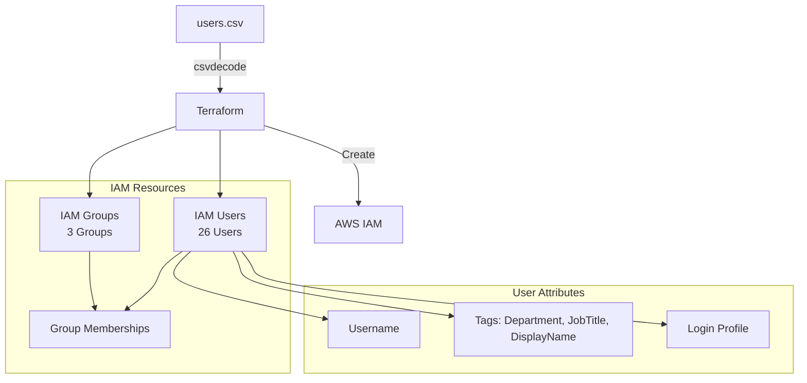
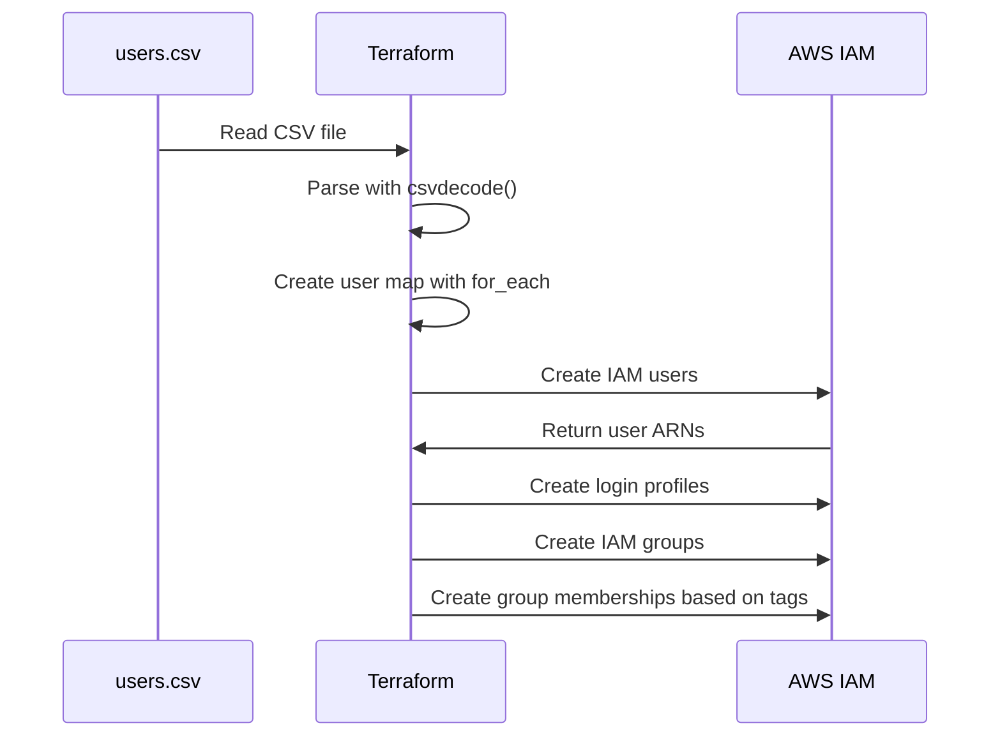
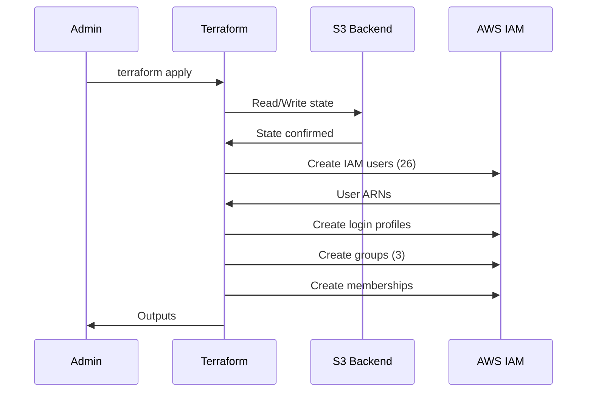
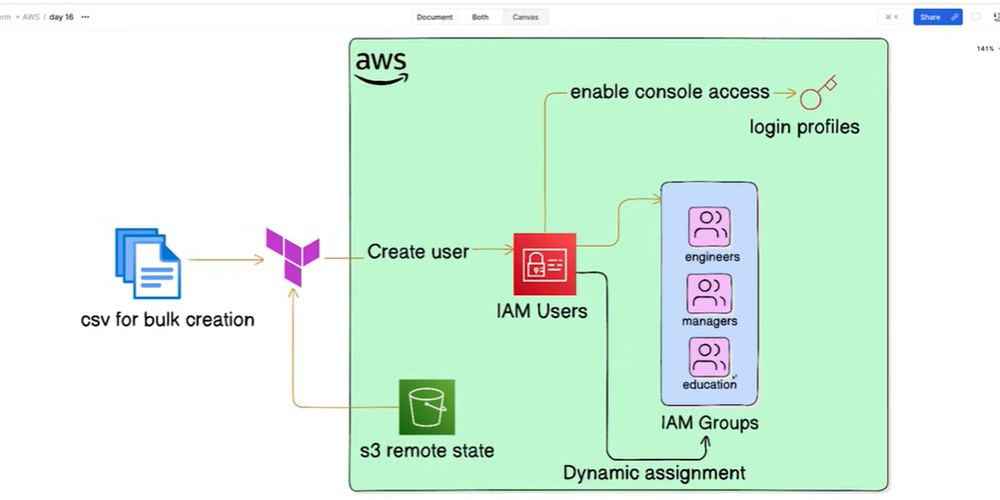

# Project 3: AWS IAM User Management - System Design

## 1. Architecture Overview

This project demonstrates managing AWS IAM users, groups, and group memberships using Terraform with a CSV file as the data source. It provides a declarative approach to IAM user management, similar to Azure AD user management in the AWS ecosystem.

### High-Level Architecture



### Data Flow



---

## 2. Component Details

### 2.1 CSV Data Source

| Column | Type | Description | Example |
|--------|------|-------------|---------|
| first_name | string | User's first name | Michael |
| last_name | string | User's last name | Scott |
| department | string | User's department | Education |
| job_title | string | User's job title | Regional Manager |

**Resource:** [`local.users`](/project_3/code/local.tf:1)

```hcl
locals {
  users = csvdecode(file("users.csv"))
}
```

### 2.2 IAM Users

| Property | Value |
|----------|-------|
| Naming Pattern | `{first_initial}_{lastname}` |
| Path | `/users/` |
| Username Format | `m_scott`, `d_schrute`, `j_halpert` |
| Count | 26 users |

**Resource:** [`aws_iam_user.users`](/project_3/code/main.tf:1)

| Tag Key | Source | Example |
|---------|--------|---------|
| Environment | Variable | production |
| DisplayName | CSV | Michael Scott |
| Department | CSV | Education |
| JobTitle | CSV | Regional Manager |

### 2.3 Login Profiles

| Property | Value |
|----------|-------|
| Password Length | 16 characters |
| Password Reset Required | true |
| MFA Support | Configurable |

**Resource:** [`aws_iam_user_login_profile.users`](/project_3/code/main.tf:15)

### 2.4 IAM Groups

| Group Name | Path | Membership Criteria |
|------------|------|---------------------|
| Education | `/groups/` | Department = "Education" |
| Managers | `/groups/` | JobTitle contains "Manager" or "CEO" |
| Engineers | `/groups/` | Department = "Engineering" |

**Resources:**
- [`aws_iam_group.education`](/project_3/code/groups.tf:2)
- [`aws_iam_group.managers`](/project_3/code/groups.tf:7)
- [`aws_iam_group.engineers`](/project_3/code/groups.tf:12)

### 2.5 Group Memberships

| Resource | Group | Members | Filter |
|----------|-------|---------|--------|
| [`aws_iam_group_membership.education_members`](/project_3/code/groups.tf:18) | Education | 1 user | Department == "Education" |
| [`aws_iam_group_membership.managers_members`](/project_3/code/groups.tf:28) | Managers | 5 users | JobTitle matches "Manager\|CEO" |
| [`aws_iam_group_membership.engineers_members`](/project_3/code/groups.tf:38) | Engineers | 0 users | Department == "Engineering" |

---

## 3. Terraform Configuration Details

### 3.1 User Creation Logic

```hcl
resource "aws_iam_user" "users" {
  for_each = { for user in local.users: user.first_name => user }
  
  name = lower("${substr(each.value.first_name, 0, 1)}_${each.value.last_name}")
  path = "/users/"

  tags = {
    Environment = var.env
    DisplayName = "${each.value.first_name} ${each.value.last_name}"
    Department = each.value.department
    JobTitle = each.value.job_title
  }
}
```

### 3.2 Dynamic Group Membership

The project uses Terraform's `for` expression to dynamically assign users to groups based on their tags:

```hcl
users = [
  for user in aws_iam_user.users : user.name 
  if user.tags.Department == "Education"
]
```

```hcl
users = [
  for user in aws_iam_user.users : user.name 
  if contains(keys(user.tags), "JobTitle") && can(regex("Manager|CEO", user.tags.JobTitle))
]
```

---

## 4. Security Configuration

### 4.1 Password Requirements

- **Password Length**: 16 characters (configurable)
- **Password Reset**: Required on first login
- **MFA**: Recommended for production environments

### 4.2 IAM Best Practices Implemented

| Practice | Implementation |
|----------|----------------|
| Least Privilege | Groups with specific policy attachments |
| Password Policy | Password reset enforced |
| Tag-Based Access | User metadata stored as tags |
| Idempotent Operations | for_each prevents duplicates |

### 4.3 Security Considerations

⚠️ **Important Notes:**
- Users must change password on first login
- Consider implementing MFA requirements
- Review IAM policies before attaching to groups
- Don't commit `terraform.tfstate` to version control
- Use AWS SSO for production environments
- Enable CloudTrail for audit logging

---

## 5. Network/Data Flow

### 5.1 User Creation Flow



### 5.2 State Management

| Backend | Purpose |
|---------|---------|
| S3 | Remote state storage with versioning |

**Resource:** [`terraform backend`](/project_3/code/backend.tf)

---

## 6. User List

| Username | Full Name | Department | Job Title |
|----------|-----------|------------|-----------|
| m_scott | Michael Scott | Education | Regional Manager |
| d_schrute | Dwight Schrute | Sales | Assistant to the Regional Manager |
| j_halpert | Jim Halpert | Sales | Sales Representative |
| p_beesly | Pam Beesly | Reception | Receptionist |
| r_howard | Ryan Howard | Temps | Temp |
| a_bernard | Andy Bernard | Sales | Sales Representative |
| r_california | Robert California | Corporate | CEO |
| s_hudson | Stanley Hudson | Sales | Sales Representative |
| k_malone | Kevin Malone | Accounting | Accountant |
| a_martin | Angela Martin | Accounting | Accountant |
| o_martinez | Oscar Martinez | Accounting | Accountant |
| p_vance | Phyllis Vance | Sales | Sales Representative |
| t_flenderson | Toby Flenderson | HR | HR Representative |
| k_kapoor | Kelly Kapoor | Customer Service | Customer Service Representative |
| d_philbin | Darryl Philbin | Warehouse | Warehouse Foreman |
| c_bratton | Creed Bratton | Quality Assurance | Quality Assurance |
| m_palmer | Meredith Palmer | Supplier Relations | Supplier Relations |
| e_hannon | Erin Hannon | Reception | Receptionist |
| g_lewis | Gabe Lewis | Corporate | Coordinating Director of Emerging Regions |
| j_levinson | Jan Levinson | Corporate | Vice President of Northeast Sales |
| d_wallace | David Wallace | Corporate | CFO |
| h_flax | Holly Flax | HR | HR Representative |
| c_miner | Charles Miner | Corporate | Vice President of the Northeast Region |
| j_bennett | Jo Bennett | Corporate | CEO of Sabre |
| c_green | Clark Green | Sales | Sales Representative |
| p_miller | Pete Miller | Customer Service | Customer Service Representative |

---

## 7. Group Membership Details

### Education Group
- **Criteria**: Department = "Education"
- **Members**: Michael Scott (m_scott)

### Managers Group
- **Criteria**: JobTitle contains "Manager" or "CEO"
- **Members**:
  - Michael Scott (Regional Manager)
  - Robert California (CEO)
  - Darryl Philbin (Warehouse Foreman)
  - David Wallace (CFO)
  - Jo Bennett (CEO of Sabre)

### Engineers Group
- **Criteria**: Department = "Engineering"
- **Members**: None (no users with Engineering department in CSV)

---

## 8. Design Decisions

### 8.1 Why CSV as Data Source?

| Benefit | Description |
|---------|-------------|
| Easy Editing | Non-technical users can add/modify users |
| Version Control | Track changes in Git |
| Bulk Operations | Add many users at once |
| Import/Export | Compatible with HR systems |

### 8.2 Why Username Pattern `{first_initial}_{lastname}`?

- **Uniqueness**: Minimizes collision risk
- **Readability**: Easy to remember and type
- **Convention**: Follows common naming standards
- **Case Insensitive**: Converted to lowercase

### 8.3 Why Tags for Group Membership?

- **Dynamic**: Membership updates automatically when tags change
- **Single Source**: CSV is the only source of truth
- **Idempotent**: Safe to run multiple times
- **Audit Trail**: Tags provide metadata for compliance

---

## 9. Cost Considerations

| Resource | Cost |
|----------|------|
| IAM Users | Free |
| IAM Groups | Free |
| IAM Group Memberships | Free |
| S3 Backend (state) | ~$0.01/month |

**Note**: IAM is generally free for user and group management. Costs only apply to specific advanced features.

---

## 10. Outputs

| Output | Description |
|--------|-------------|
| account_id | AWS Account ID |
| user_names | List of all created usernames |
| user_passwords | Initial passwords (sensitive) |

**Resource:** [`aws_iam_user_login_profile`](/project_3/code/output.tf)

---

## 11. Architecture Diagram



The architecture diagram illustrates the complete IAM user management flow:

- **CSV Input**: User data is sourced from `users.csv`
- **Terraform Processing**: CSV is parsed using `csvdecode()` and processed with `for_each`
- **IAM Resources**: 26 users, 3 groups, and dynamic memberships are created
- **User Attributes**: Tags (Department, JobTitle, DisplayName) drive group membership
- **Login Profiles**: Console access enabled with password reset required

---

## 12. Extensibility

### Adding More Groups

1. Add group resource in [`groups.tf`](/project_3/code/groups.tf):

```hcl
resource "aws_iam_group" "new_group" {
  name = "NewGroup"
  path = "/groups/"
}

resource "aws_iam_group_membership" "new_group_members" {
  name  = "new-group-membership"
  group = aws_iam_group.new_group.name
  
  users = [
    for user in aws_iam_user.users : user.name 
    if user.tags.Department == "DesiredDepartment"
  ]
}
```

### Attaching Policies

```hcl
resource "aws_iam_group_policy_attachment" "example" {
  group      = aws_iam_group.managers.name
  policy_arn = "arn:aws:iam::aws:policy/ReadOnlyAccess"
}
```

---

## 13. Related Files

- [main.tf](/project_3/code/main.tf) - User and login profile creation
- [groups.tf](/project_3/code/groups.tf) - Group and membership management
- [users.csv](/project_3/code/users.csv) - User data source
- [variables.tf](/project_3/code/variables.tf) - Input variables
- [output.tf](/project_3/code/output.tf) - Output definitions
- [provider.tf](/project_3/code/provider.tf) - AWS provider configuration
- [backend.tf](/project_3/code/backend.tf) - Remote state configuration

---

## 14. Comparison with Other Projects

| Aspect | Project 1 | Project 2 | Project 3 |
|--------|-----------|-----------|-----------|
| Service | S3 + CloudFront | VPC + EC2 | IAM |
| Complexity | Low | Medium | Low |
| Data Source | Static files | AWS resources | CSV file |
| Use Case | Website hosting | Networking | User management |
| Cost | ~$0.50/month | ~$10/month | ~$0.01/month |
