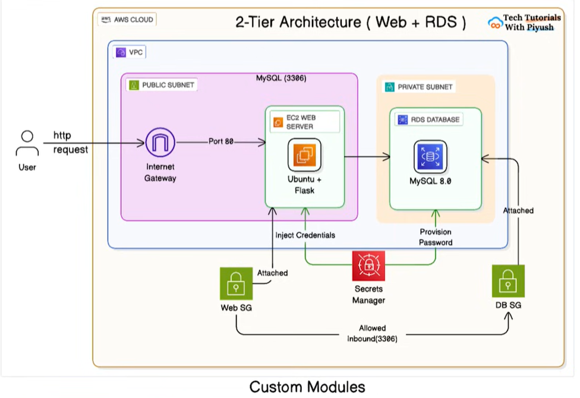

# Day 22: RDS Database (Mini Project 8)

## Overview

This project demonstrates deploying a complete web application stack on AWS using Terraform with a modular architecture. The infrastructure includes:

- **VPC** with public and private subnets
- **EC2 Instance** running a Flask web application on Ubuntu
- **RDS MySQL Database** in private subnets for secure database access
- **Security Groups** to control network access

## Architecture

```
┌─────────────────────────────────────────────────────────────┐
│                         VPC (10.0.0.0/16)                   │
│  ┌─────────────────────┐   ┌─────────────────────────────┐  │
│  │   Public Subnet     │   │     Private Subnets         │  │
│  │   (10.0.1.0/24)     │   │  (10.0.2.0/24, 10.0.3.0/24) │  │
│  │                     │   │                             │  │
│  │  ┌───────────────┐  │   │    ┌──────────────────┐     │  │
│  │  │  EC2 (Flask)  │──│───│───►│   RDS MySQL      │     │  │
│  │  │  Web Server   │  │   │    │   Database       │     │  │
│  │  └───────────────┘  │   │    └──────────────────┘     │  │
│  └─────────────────────┘   └─────────────────────────────┘  │
│           │                                                  │
│           ▼                                                  │
│  ┌─────────────────┐                                        │
│  │ Internet Gateway│                                        │
│  └─────────────────┘                                        │
└─────────────────────────────────────────────────────────────┘
           │
           ▼
      Internet (Users)
```

[]

## Project Structure

```
project_6/
├── main.tf                          # Root module - orchestrates all modules
├── variables.tf                     # Root variables
├── outputs.tf                       # Root outputs
├── terraform.tfvars.example         # Example variable values
├── README.md                        # This file
└── modules/
    ├── vpc/                         # VPC Module
    │   ├── main.tf
    │   ├── variables.tf
    │   └── outputs.tf
    ├── security_groups/             # Security Groups Module
    │   ├── main.tf
    │   ├── variables.tf
    │   └── outputs.tf
    ├── rds/                         # RDS Module
    │   ├── main.tf
    │   ├── variables.tf
    │   └── outputs.tf
    └── ec2/                         # EC2 Module
        ├── main.tf
        ├── variables.tf
        ├── outputs.tf
        └── templates/
            └── user_data.sh         # EC2 bootstrap script
```

## Prerequisites

- AWS CLI configured with appropriate credentials
- Terraform >= 1.0 installed
- An AWS account with permissions to create VPC, EC2, RDS, and Security Group resources

## Usage

### 1. Initialize Terraform

```bash
terraform init
```

### 2. Review the Plan

```bash
terraform plan
```

### 3. Deploy the Infrastructure

```bash
terraform apply
```

### 4. Access the Application

After deployment, Terraform will output the application URL. Open it in your browser:

```bash
# Get the application URL
terraform output application_url
```

The Flask application has three endpoints:
- `/` - Home page
- `/health` - Database connectivity health check
- `/db-info` - Database information

### 5. Clean Up

```bash
terraform destroy
```

## Configuration

You can customize the deployment by creating a `terraform.tfvars` file:

```hcl
# Copy from terraform.tfvars.example
project_name = "my-rds-project"
environment  = "dev"
aws_region   = "us-west-2"

# Database settings
db_name     = "myappdb"
db_username = "admin"
db_password = "YourSecurePassword123!"  # Use a strong password!
```

## Modules

### VPC Module
Creates the network infrastructure including VPC, subnets, internet gateway, and route tables.

### Security Groups Module
Creates security groups for:
- **Web Server**: Allows HTTP (80) and SSH (22) from anywhere
- **Database**: Allows MySQL (3306) only from the web server security group

### RDS Module
Deploys a MySQL RDS instance in private subnets with a DB subnet group.

### EC2 Module
Deploys an Ubuntu EC2 instance with:
- Flask web application
- MySQL client for database connectivity
- Systemd service for application management

## Security Notes

⚠️ **Important Security Considerations:**

1. The default password in `variables.tf` is for demo purposes only. Always use strong, unique passwords in production.
2. SSH access is open to the world (0.0.0.0/0). Restrict this to your IP in production.
3. Consider using AWS Secrets Manager for database credentials in production.
4. Enable RDS encryption for production workloads.

## Troubleshooting

1. **Application not responding**: Wait 2-3 minutes after deployment for EC2 user data script to complete.
2. **Database connection errors**: Verify security group rules and ensure RDS is in `available` state.
3. **RDS creation slow**: RDS instances typically take 5-10 minutes to provision.

## Outputs

| Output | Description |
|--------|-------------|
| `vpc_id` | ID of the created VPC |
| `web_server_public_ip` | Public IP of the EC2 instance |
| `web_server_public_dns` | Public DNS of the EC2 instance |
| `application_url` | URL to access the Flask application |
| `rds_endpoint` | RDS instance endpoint |
| `rds_port` | RDS instance port |
| `database_name` | Name of the database |